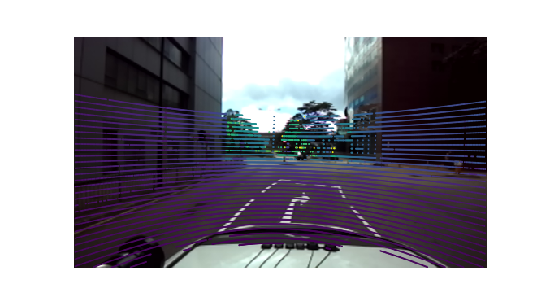
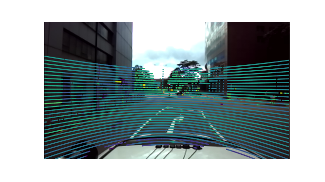

## UrbanNav-HK-Medium-Urban-1
### depth coloring

### intensity coloring

### useful links
https://github.com/nutonomy/nuscenes-devkit

https://github.com/kuixu/kitti_object_vis/blob/master/kitti_util.py

https://github.com/AiltonOliveir/PYPCD_python3

https://github.com/IPNL-POLYU/UrbanNavDataset

https://github.com/naurril/SUSTechPOINTS
